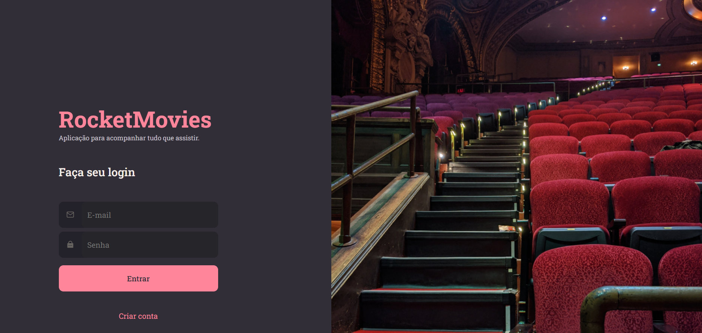

<h1 align="center"> Rocketmovies </h1>
<p align="center">Listar seus filmes preferidos!</p>

<h4 align="center">Versão 1.0</h4>
<p align="center">
<a href="#sobre">Sobre</a>&nbsp;&nbsp;&nbsp;|&nbsp;&nbsp;&nbsp;
<a href="#requisitos">Requisitos</a>&nbsp;&nbsp;&nbsp;|&nbsp;&nbsp;&nbsp;
<a href="#telas">Telas</a>&nbsp;&nbsp;&nbsp;|&nbsp;&nbsp;&nbsp;
<a href="#tecnologias">Tecnologias</a>&nbsp;&nbsp;&nbsp;|&nbsp;&nbsp;&nbsp;
<a href="#layout">Layout</a>&nbsp;&nbsp;&nbsp;|&nbsp;&nbsp;&nbsp;
<a href="#instalação">Instalação</a>&nbsp;&nbsp;&nbsp;
<br>

<p align="center">


## Sobre

O Rocketmovies é uma aplicação para você  listar seus filmes preferidos.!

**OBS:** Esta é a versão final do projeto com o Front-end e Api.

## Requisitos

- Deve ser possível cadastrar novos usuarios
- Deve ser possível autenticar usuarios
- Deve ser possível listar filmes cadastrados pelo usuario
- Deve ser possível consultar filmes cadastrados pelo usuario
- Deve ser possível visualizar filmes e suas caracteristicas como titulo, descrição e tags
- Deve ser possível cadastrar novos filmes
- Deve ser possível atualizar informações e imagem do usuario


## Telas
Esse projeto foi desenvolvido as seguintes telas:

- Tela de autenticação de usuarios 
- Tela de Cadastro de usuarios
- Tela de update de usuarios
- Tela listagem de filmes
- Tela de visualização de filme
- Tela cadastro de novos filmes

<p align="center">
  
  
  
  
  
  
</p>


## Tecnologias
Esse projeto foi desenvolvido com as seguintes tecnologias:

- Javascript
- React
- Vite
- Styled Components
- Node
- Express
- Knex
- Sqlite
- SQLite3
- JWT
- Multer
- JSON Web Token
- bcrypt.js
- Git e Github

## Layout

Link do layout usado no projeto:

- [Layout Figma](https://www.figma.com/file/UObYagRzmvi5PY4HhmzEHM/RocketMovies/duplicate?type=design&node-id=0-1&mode=design)

## Instalação 

Para clonar e executar esta aplicação, você precisará do [Git](https://git-scm.com/). A partir de sua linha de comando:

```bash
# Clone este repositório
$ git clone git@github.com:BrunoBianchi13/Rocket-Movies.git

# Entre no repositório
$ cd Rocket-Movies/api

# Instale as package.json
$ npm install

# Executar o programa
$ npm start

# A API estará ativa em http://localhost:3333

# Entre no repositório
$ cd Rocket-Movies/RocketMovies

# Instale as package.json
$ npm install

# Executar o programa
$ npm run dev

# O RocketMovies estará ativo em http://localhost:5173

```


## 💻 Projeto


- [Acesse o projeto completo](https://foodexplorer-api-3zw2.onrender.com)


<p align="center">
Feito by Bruno Bianchi
</p>
